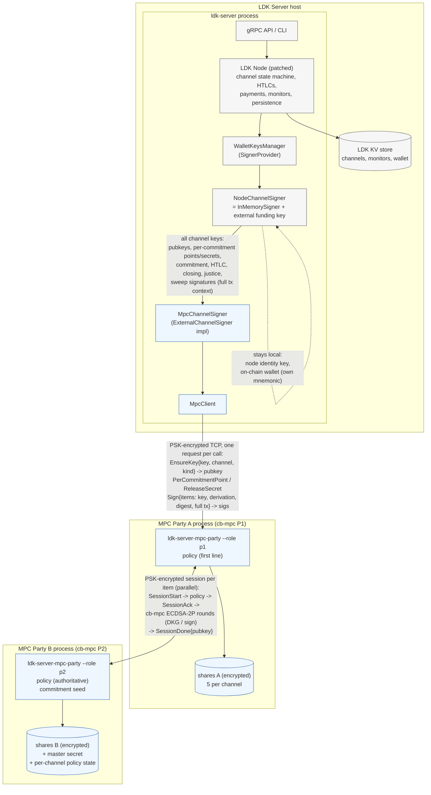

# LDK Server

**LDK Server** is a fully-functional Lightning node in daemon form, built on top of
[LDK Node](https://github.com/lightningdevkit/ldk-node), which itself provides a powerful abstraction over the
[Lightning Development Kit (LDK)](https://github.com/lightningdevkit/rust-lightning) and uses a built-in
[Bitcoin Development Kit (BDK)](https://bitcoindevkit.org/) wallet.

The primary goal of LDK Server is to provide an efficient, stable, and API-first solution for deploying and managing
a Lightning Network node. With its streamlined setup, LDK Server enables users to easily set up, configure, and run
a Lightning node while exposing a robust, language-agnostic API via [Protocol Buffers (Protobuf)](https://protobuf.dev/).

> **Warning**
> LDK Server is still under active development and is not ready for production use. Until the v0.1 release, the
> persisted data model may change in non-backwards-compatible ways. Do not run it with funds you cannot afford to lose.

## Workspace Crates

- `ldk-server`: daemon that runs the Lightning node and exposes the API
- `ldk-server-cli`: CLI client for the server API
- `ldk-server-client`: Rust client library for authenticated TLS gRPC calls
- `ldk-server-grpc`: generated protobuf and shared gRPC types
- `ldk-server-macaroons`: shared token parsing, signing, derivation, and request binding
- `ldk-server-mcp`: stdio MCP bridge exposing unary `ldk-server` RPCs as MCP tools
- `ldk-server-mpc`: Coinbase cb-mpc 2-of-2 MPC party service and client for channel funding keys (see [MPC Channel Signing](#mpc-channel-signing-coinbase-cb-mpc))

### Features

- **Out-of-the-Box Lightning Node**:
    - Deploy a Lightning Network node with minimal configuration, no coding required.

- **API-First Design**:
    - Exposes a well-defined gRPC API using Protobuf, allowing seamless integration with any language.

- **Powered by LDK**:
    - Built on top of LDK-Node, leveraging the modular, reliable, and high-performance architecture of LDK.

- **Effortless Integration**:
    - Ideal for embedding Lightning functionality into payment processors, self-hosted nodes, custodial wallets, or other Lightning-enabled
      applications.

### Project Status

**Work in Progress**:
- APIs are under development. Expect breaking changes as the project evolves.
- Not tested for production use.
- We welcome your feedback and contributions to help shape the future of LDK Server!

### Quick Start

```bash
git clone https://github.com/lightningdevkit/ldk-server.git
cd ldk-server
cargo build --release
cp contrib/ldk-server-config.toml my-config.toml  # edit with your settings
./target/release/ldk-server my-config.toml
```

See [Getting Started](docs/getting-started.md) for a full walkthrough.

### Documentation

| Document | Description |
|----------|-------------|
| [Getting Started](docs/getting-started.md) | Install, configure, and run your first node |
| [Configuration](docs/configuration.md) | All config options, environment variables, and Bitcoin backend tradeoffs |
| [API Guide](docs/api-guide.md) | gRPC transport, authentication, and endpoint reference |
| [Tor](docs/tor.md) | Connecting to and receiving connections over Tor |
| [Operations](docs/operations.md) | Production deployment, backups, and monitoring |

### API

The canonical API definitions are in [`ldk-server-grpc/src/proto/`](ldk-server-grpc/src/proto/). A ready-made
Rust client library is provided in [`ldk-server-client/`](ldk-server-client/).

### MCP Bridge

The workspace also includes `ldk-server-mcp`, a stdio [Model Context Protocol](https://spec.modelcontextprotocol.io/) server
that lets MCP-compatible clients call the unary `ldk-server` RPC surface as tools.

Run it directly from the workspace:
```bash
cargo run -p ldk-server-mcp -- --config /path/to/config.toml
```

It is covered by both crate-local tests and an `e2e-tests` sanity suite against a live `ldk-server` instance.


### MPC Channel Signing (Coinbase cb-mpc)

This fork puts **every channel key** (funding, payment, delayed-payment, HTLC and revocation
basepoints) and the per-commitment secrets under [Coinbase cb-mpc](https://github.com/coinbase/cb-mpc)
two-party ECDSA. Two independent MPC processes each hold one share of every key; the complete
private keys are never assembled. Party B holds the commitment seed and enforces a signing
policy: it recomputes every sighash from the transaction it is given, checks key kinds and
BOLT 3 derivations, keeps commitment numbers monotonic, releases per-commitment secrets only
once a newer holder commitment was validated, tracks our balance in every commitment and
caps how much it may drop per update, and only signs closes and sweeps that pay an
allow-listed script (the wallet's xpub). Links are PSK-authenticated and encrypted; shares
are encrypted at rest. All Lightning channel state stays in LDK Server / LDK Node. Details,
build steps and remaining work are in [`ldk-server-mpc/README.md`](ldk-server-mpc/README.md);
measurements are in [`docs/mpc-benchmarks.md`](docs/mpc-benchmarks.md).

#### Architecture



- **LDK Server** owns all Lightning state and the on-chain wallet; it never sees a funding
  private key.
- **Party A (P1)** is the only endpoint LDK Server talks to and the only party that
  obtains the final signature (a property of cb-mpc ECDSA-2P). It holds the A shares and
  runs the policy as a first line.
- **Party B (P2)** only accepts protocol sessions from Party A, holds the B shares, the
  commitment-seed master secret and the per-channel policy counters, and is the authoritative
  policy. It never sees LDK's database; everything it checks it recomputes from the
  transaction bytes in the request.

#### Signing flow for one commitment update (funding signature + one HTLC signature)

```text
 LDK channel state machine        MpcChannelSigner           Party A (P1)                    Party B (P2)
 ────────────────────────         ────────────────           ────────────                    ────────────
 sign_counterparty_commitment ─┐
   build commitment + HTLC txs │
   funding sighash, HTLC sighash
                               ├─▶ items: [funding key, none, digest, full tx ctx],
                               │          [htlc basepoint, +SHA256(pcp‖base), digest, htlc tx ctx]
                               │   Sign{channel, items} ──▶ policy.authorize(each item)
                               │                            derive share (+tweak) locally
                               │                            ┌─ session 1 ──SessionStart──▶ policy: sighash ✓, key kind ✓,
                               │                            │                               derivation ✓, commitment nr ✓,
                               │                            │                               balance by script ✓ (cap)
                               │                            │  ◀──── SessionAck ────────── derive share B (+tweak)
                               │                            │  ◀═ cb-mpc ECDSA-2P sign ═▶
                               │                            │  ◀──── SessionDone{pubkey}── commit state
                               │                            └─ session 2 (in parallel) ... same for the HTLC item
                               │                            verify each sig vs derived pubkey, low-S
                               │   ◀── [sig, sig]
                               │   verify vs locally derived pubkeys
 ◀─ (funding sig, HTLC sigs) ──┘
 ...
 validate_holder_commitment(n) ──▶ HolderCommitmentValidated{n} ──▶ (mirror) ──▶ record n
 release_commitment_secret(n+1) ─▶ ReleaseSecret{n+1} ──▶ forward ──▶ seed: allowed iff n+1 > validated(n)
```

#### What is MPC-backed (`coverage = "all"`)

| Key / operation                                        | Backing                                    |
|--------------------------------------------------------|--------------------------------------------|
| Funding key, spliced funding keys                      | **cb-mpc 2-of-2 (A + B)**, fresh DKG per splice |
| Payment point (`to_remote`)                            | MPC                                        |
| Delayed-payment / HTLC basepoints and per-commitment keys | MPC, per-commitment key = share + BOLT 3 tweak |
| Revocation basepoint and revocation keys               | MPC, `share·H1 + secret·H2` on shares      |
| Per-commitment secrets and points                      | **Party B only**, released under policy    |
| Commitment, HTLC, closing, anchor, splice, justice, sweep signatures | MPC                           |
| Node identity, gossip, BOLT12                          | local                                      |
| On-chain wallet (BDK)                                  | local, own mnemonic; Party B only pays out to its addresses |

`coverage = "funding"` keeps the original funding-key-only mode.

With full coverage and Party B on separate infrastructure, an attacker who controls the LDK
Server host cannot produce any channel signature, sweep any channel output, obtain a
per-commitment secret early, get an old state or a balance-draining commitment signed, or
redirect a close or sweep away from the allow-listed wallet. They can still broadcast the
latest already-signed commitment (a force-close whose outputs only sweep to the wallet),
stall the node, and spend the on-chain wallet, whose mnemonic remains on the host
(`onchain_wallet_mnemonic_path` keeps it separate from the node seed; moving it off-host is
the remaining step).

#### Measured performance (Apple M4, both parties on one machine, cb-mpc `0b71670`)

| Operation                                               | p50     | p95     | p99     | Throughput |
|---------------------------------------------------------|---------|---------|---------|------------|
| DKG, one key (full path)                                | 151 ms  | 400 ms  | 400 ms  | ~5 /s      |
| DKG, all five channel keys in parallel (channel open)   | ~430 ms wall |    |         |            |
| Sign, one key, concurrency 1                            | 42.6 ms | 43.6 ms | 45.3 ms | 23.4 /s    |
| Sign, one key, concurrency 4                            | 46.0 ms | 52.1 ms | 56.6 ms | 85.5 /s    |
| Commitment update, no HTLC (policy + 1 session)         | 53 ms   |         | 65 ms   |            |
| Commitment update with 1 HTLC (2 parallel sessions)     | 64 ms   |         | 89 ms   |            |
| Signet: commitment / closing / holder commitment        | 40–66 / 40 / 44–73 ms |  |        |            |

Each party uses ~3.4 MB RSS and 35–50 % of one core while signing at concurrency 1. A
direct-channel BOLT11 payment adds roughly 110–130 ms of MPC time (two commitment updates,
each with the HTLC signature in parallel); on signet a 20,000 sat receive completed 164 ms
after the send command. See [`docs/mpc-benchmarks.md`](docs/mpc-benchmarks.md).

#### Running it

```bash
# one-time: build cb-mpc (+ derivation patch) and the patched ldk-node (see ldk-server-mpc/README.md)
cargo build --release -p ldk-server -p ldk-server-cli -p ldk-server-mpc
contrib/mpc-signet/run-mpc-parties.sh                 # Party B then Party A, separate keystores
target/release/ldk-server contrib/mpc-signet/ldk-server-signet-mpc.toml   # [mpc] party_address, coverage, auth_key_path
```

Production layout: Party A with `--auth-key-file`/`--peer-auth-key-file`/`--share-key-file`,
LDK Server with `[mpc] auth_key_path` and `[node] onchain_wallet_mnemonic_path`, then Party B
on separate infrastructure with the same peer PSK and `--payout-xpub $(cat <storage>/onchain_wallet_xpub)`.

Tests: `cargo test -p ldk-server-mpc` (two-party DKG/sign/derivation, policy, secure
transport and service tests) and `cd e2e-tests && cargo test --test mpc -- --test-threads=1`
(regtest, full coverage: open with five DKGs, pay both ways, restart parties and server,
cooperative close with a DKG'd key verified on-chain, force close; PSK links, encrypted
shares and Party B allow-listing the wallet xpub).

### Contributing

Contributions are welcome! Please see [CONTRIBUTING.md](CONTRIBUTING.md) for guidelines on building, testing, code style, and development workflow.
