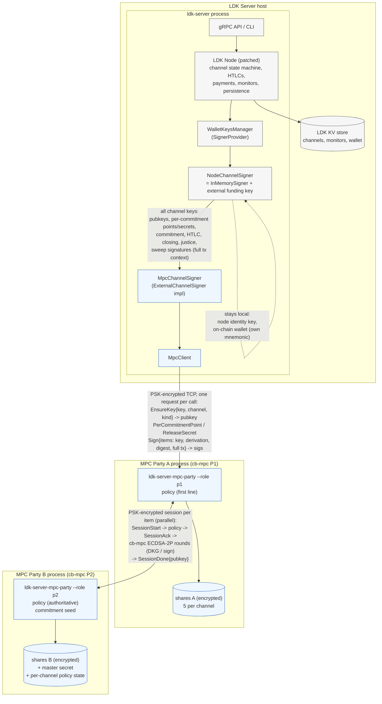

# ldk-server fork: Coinbase cb-mpc channel signing for Lightning

**This is a fork of [lightningdevkit/ldk-server](https://github.com/lightningdevkit/ldk-server)
whose only purpose is to test putting Lightning channel keys under Coinbase's
[cb-mpc](https://github.com/coinbase/cb-mpc) 2-of-2 ECDSA MPC.** It is not a release of LDK
Server; for the daemon itself use upstream. Upstream's README, API docs and contribution
guide are unchanged under `docs/`, `ldk-server-grpc/` and `CONTRIBUTING.md`.

## What it does

Every channel key of an LDK Server node (funding, payment, delayed-payment, HTLC and
revocation basepoints) is a cb-mpc 2-of-2 distributed key, and the per-commitment secrets live
on the second MPC party. Two independent MPC processes each hold one share of every key; the
complete private keys are never assembled. Per-commitment keys are derived on the shares with
the BOLT 3 tweaks (two small additions to cb-mpc's ECDSA-2P API, included as a patch).

Party B is a validating signer: it recomputes every sighash from the transaction it is given,
checks that the key kind matches the operation and that derivations match BOLT 3, keeps
commitment numbers monotonic, releases a per-commitment secret only after a newer holder
commitment was validated, tracks the node's balance in every commitment and caps how much it
may drop per update, and only signs cooperative closes and sweeps that pay an allow-listed
script (the node's wallet xpub). Links are PSK-authenticated and encrypted; key shares are
encrypted at rest. All Lightning channel state stays in LDK Server / LDK Node.

## Status (2026-10-08)

- **Regtest, full coverage:** two LDK Servers, one MPC-backed. Channel open (five DKGs),
  payments both ways, restart of the MPC parties, restart of LDK Server, cooperative close
  with a DKG'd key verified in the on-chain 2-of-2 script, and a holder force-close, with
  PSK links, encrypted shares and Party B allow-listing the wallet xpub. `e2e-tests/tests/mpc.rs`.
- **Signet, funding-key coverage:** channels with Blink's staging LND node and a second LDK
  Server; keysend sent, 20,000 sat received, 7,000 sat sent, restart with shares restored,
  cooperative close and force close confirmed on-chain with the DKG'd keys in their witness
  scripts. Log in [`docs/mpc-signet-demo.md`](docs/mpc-signet-demo.md).
- **Latency, both parties on one machine:** commitment update 53 ms, with one HTLC 64 ms,
  closing 47 ms; a payment adds roughly 110 to 130 ms. [`docs/mpc-benchmarks.md`](docs/mpc-benchmarks.md).
- **Tests:** `cargo test -p ldk-server-mpc` (DKG/sign/derivation, policy, secure transport,
  service) and `cd e2e-tests && cargo test --test mpc -- --test-threads=1` (regtest,
  downloads bitcoind).

## Not yet covered

- The on-chain wallet mnemonic is still on the LDK Server host. It is separate from the node
  seed (`onchain_wallet_mnemonic_path`) and Party B only pays out to its addresses, so a host
  compromise can force funds *into* the wallet but not elsewhere; moving on-chain signing
  off-host is the remaining step.
- Party B must run on separate infrastructure with its own operator to be a trust boundary.
- HTLC-level accounting is not enforced; counterparty revocation notices are recorded, not
  verified. The balance cap is a per-update delta, not a price-based rule.
- The two cb-mpc derivation functions use cb-mpc's internal key representation and are outside
  its public, bug-bounty-covered API.
- Splicing and the full-coverage mode were not exercised on signet.

## Where things are

- [`ldk-server-mpc/`](ldk-server-mpc/): cb-mpc FFI, party service, client, policy, secure
  transport. [`ldk-server-mpc/README.md`](ldk-server-mpc/README.md) has the detailed design,
  build steps (cb-mpc, custom OpenSSL, patched ldk-node) and security notes.
- [`ldk-server/src/mpc_signer.rs`](ldk-server/src/mpc_signer.rs): the `ExternalChannelSigner`
  implementation; `[mpc]` config in [`docs/configuration.md`](docs/configuration.md).
- [`contrib/patches/`](contrib/patches/): the ldk-node patch (`ExternalChannelSigner`,
  separate wallet entropy, `signer_unblocked` poke) and the cb-mpc derivation patch. The
  workspace `Cargo.toml` expects the patched ldk-node at `../ldk-node` and cb-mpc at
  `../cb-mpc`.
- [`contrib/mpc-signet/`](contrib/mpc-signet/): signet config and party launch scripts.

## Build and run

```bash
# one-time: cb-mpc (+ derivation patch) with its custom OpenSSL, and the patched ldk-node
#           (see ldk-server-mpc/README.md)
cargo build --release -p ldk-server -p ldk-server-cli -p ldk-server-mpc

# Party A (creates the PSK / share key files if missing)
target/release/ldk-server-mpc-party --role p1 --listen 127.0.0.1:7701 --peer 127.0.0.1:7702 \
  --keystore mpc/a --auth-key-file mpc/client.psk --peer-auth-key-file mpc/peer.psk \
  --share-key-file mpc/share-a.key
# LDK Server on a FRESH storage dir with [mpc] party_address / coverage / auth_key_path and
# [node] onchain_wallet_mnemonic_path; it writes <storage>/onchain_wallet_xpub
target/release/ldk-server my-config.toml
# Party B (on separate infrastructure) with the wallet xpub allow-listed
target/release/ldk-server-mpc-party --role p2 --listen 127.0.0.1:7702 --keystore mpc/b \
  --peer-auth-key-file mpc/peer.psk --share-key-file mpc/share-b.key \
  --payout-xpub "$(cat <storage>/onchain_wallet_xpub)" --max-balance-decrease-sat 100000
```

## Architecture



- **LDK Server** owns all Lightning state and the on-chain wallet; it never sees a funding
  private key.
- **Party A (P1)** is the only endpoint LDK Server talks to and the only party that
  obtains the final signature (a property of cb-mpc ECDSA-2P). It holds the A shares and
  runs the policy as a first line.
- **Party B (P2)** only accepts protocol sessions from Party A, holds the B shares, the
  commitment-seed master secret and the per-channel policy counters, and is the authoritative
  policy. It never sees LDK's database; everything it checks it recomputes from the
  transaction bytes in the request.

## Signing flow for one commitment update (funding signature + one HTLC signature)

```text
 LDK channel state machine        MpcChannelSigner           Party A (P1)                    Party B (P2)
 ────────────────────────         ────────────────           ────────────                    ────────────
 sign_counterparty_commitment ─┐
   build commitment + HTLC txs │
   funding sighash, HTLC sighash
                               ├─▶ items: [funding key, none, digest, full tx ctx],
                               │          [htlc basepoint, +SHA256(pcp‖base), digest, htlc tx ctx]
                               │   Sign{channel, items} ──▶ policy.authorize(each item)
                               │                            derive share (+tweak) locally
                               │                            ┌─ session 1 ──SessionStart──▶ policy: sighash ✓, key kind ✓,
                               │                            │                               derivation ✓, commitment nr ✓,
                               │                            │                               balance by script ✓ (cap)
                               │                            │  ◀──── SessionAck ────────── derive share B (+tweak)
                               │                            │  ◀═ cb-mpc ECDSA-2P sign ═▶
                               │                            │  ◀──── SessionDone{pubkey}── commit state
                               │                            └─ session 2 (in parallel) ... same for the HTLC item
                               │                            verify each sig vs derived pubkey, low-S
                               │   ◀── [sig, sig]
                               │   verify vs locally derived pubkeys
 ◀─ (funding sig, HTLC sigs) ──┘
 ...
 validate_holder_commitment(n) ──▶ HolderCommitmentValidated{n} ──▶ (mirror) ──▶ record n
 release_commitment_secret(n+1) ─▶ ReleaseSecret{n+1} ──▶ forward ──▶ seed: allowed iff n+1 > validated(n)
```

## What is MPC-backed (`coverage = "all"`)

| Key / operation                                        | Backing                                    |
|--------------------------------------------------------|--------------------------------------------|
| Funding key, spliced funding keys                      | **cb-mpc 2-of-2 (A + B)**, fresh DKG per splice |
| Payment point (`to_remote`)                            | MPC                                        |
| Delayed-payment / HTLC basepoints and per-commitment keys | MPC, per-commitment key = share + BOLT 3 tweak |
| Revocation basepoint and revocation keys               | MPC, `share·H1 + secret·H2` on shares      |
| Per-commitment secrets and points                      | **Party B only**, released under policy    |
| Commitment, HTLC, closing, anchor, splice, justice, sweep signatures | MPC                           |
| Node identity, gossip, BOLT12                          | local                                      |
| On-chain wallet (BDK)                                  | local, own mnemonic; Party B only pays out to its addresses |

`coverage = "funding"` keeps the original funding-key-only mode.

With full coverage and Party B on separate infrastructure, an attacker who controls the LDK
Server host cannot produce any channel signature, sweep any channel output, obtain a
per-commitment secret early, get an old state or a balance-draining commitment signed, or
redirect a close or sweep away from the allow-listed wallet. They can still broadcast the
latest already-signed commitment (a force-close whose outputs only sweep to the wallet),
stall the node, and spend the on-chain wallet, whose mnemonic remains on the host
(`onchain_wallet_mnemonic_path` keeps it separate from the node seed; moving it off-host is
the remaining step).

## Measured performance (Apple M4, both parties on one machine, cb-mpc `0b71670`)

| Operation                                               | p50     | p95     | p99     | Throughput |
|---------------------------------------------------------|---------|---------|---------|------------|
| DKG, one key (full path)                                | 151 ms  | 400 ms  | 400 ms  | ~5 /s      |
| DKG, all five channel keys in parallel (channel open)   | ~430 ms wall |    |         |            |
| Sign, one key, concurrency 1                            | 42.6 ms | 43.6 ms | 45.3 ms | 23.4 /s    |
| Sign, one key, concurrency 4                            | 46.0 ms | 52.1 ms | 56.6 ms | 85.5 /s    |
| Commitment update, no HTLC (policy + 1 session)         | 53 ms   |         | 65 ms   |            |
| Commitment update with 1 HTLC (2 parallel sessions)     | 64 ms   |         | 89 ms   |            |
| Signet: commitment / closing / holder commitment        | 40–66 / 40 / 44–73 ms |  |        |            |

Each party uses ~3.4 MB RSS and 35–50 % of one core while signing at concurrency 1. A
direct-channel BOLT11 payment adds roughly 110–130 ms of MPC time (two commitment updates,
each with the HTLC signature in parallel); on signet a 20,000 sat receive completed 164 ms
after the send command. See [`docs/mpc-benchmarks.md`](docs/mpc-benchmarks.md).

## Running it

```bash
# one-time: build cb-mpc (+ derivation patch) and the patched ldk-node (see ldk-server-mpc/README.md)
cargo build --release -p ldk-server -p ldk-server-cli -p ldk-server-mpc
contrib/mpc-signet/run-mpc-parties.sh                 # Party B then Party A, separate keystores
target/release/ldk-server contrib/mpc-signet/ldk-server-signet-mpc.toml   # [mpc] party_address, coverage, auth_key_path
```

Production layout: Party A with `--auth-key-file`/`--peer-auth-key-file`/`--share-key-file`,
LDK Server with `[mpc] auth_key_path` and `[node] onchain_wallet_mnemonic_path`, then Party B
on separate infrastructure with the same peer PSK and `--payout-xpub $(cat <storage>/onchain_wallet_xpub)`.

Tests: `cargo test -p ldk-server-mpc` (two-party DKG/sign/derivation, policy, secure
transport and service tests) and `cd e2e-tests && cargo test --test mpc -- --test-threads=1`
(regtest, full coverage: open with five DKGs, pay both ways, restart parties and server,
cooperative close with a DKG'd key verified on-chain, force close; PSK links, encrypted
shares and Party B allow-listing the wallet xpub).

## Upstream

Everything outside the files listed above is upstream LDK Server at commit 08316de (synced
2026-10-07). See [lightningdevkit/ldk-server](https://github.com/lightningdevkit/ldk-server).
