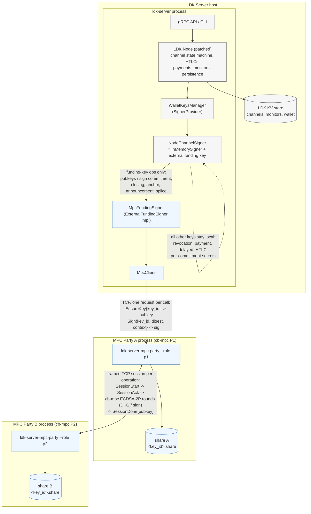

# LDK Server

**LDK Server** is a fully-functional Lightning node in daemon form, built on top of
[LDK Node](https://github.com/lightningdevkit/ldk-node), which itself provides a powerful abstraction over the
[Lightning Development Kit (LDK)](https://github.com/lightningdevkit/rust-lightning) and uses a built-in
[Bitcoin Development Kit (BDK)](https://bitcoindevkit.org/) wallet.

The primary goal of LDK Server is to provide an efficient, stable, and API-first solution for deploying and managing
a Lightning Network node. With its streamlined setup, LDK Server enables users to easily set up, configure, and run
a Lightning node while exposing a robust, language-agnostic API via [Protocol Buffers (Protobuf)](https://protobuf.dev/).

> **Warning**
> LDK Server is still under active development and is not ready for production use. Until the v0.1 release, the
> persisted data model may change in non-backwards-compatible ways. Do not run it with funds you cannot afford to lose.

## Workspace Crates

- `ldk-server`: daemon that runs the Lightning node and exposes the API
- `ldk-server-cli`: CLI client for the server API
- `ldk-server-client`: Rust client library for authenticated TLS gRPC calls
- `ldk-server-grpc`: generated protobuf and shared gRPC types
- `ldk-server-macaroons`: shared token parsing, signing, derivation, and request binding
- `ldk-server-mcp`: stdio MCP bridge exposing unary `ldk-server` RPCs as MCP tools
- `ldk-server-mpc`: Coinbase cb-mpc 2-of-2 MPC party service and client for channel funding keys (see [MPC Channel Signing](#mpc-channel-signing-coinbase-cb-mpc))

### Features

- **Out-of-the-Box Lightning Node**:
    - Deploy a Lightning Network node with minimal configuration, no coding required.

- **API-First Design**:
    - Exposes a well-defined gRPC API using Protobuf, allowing seamless integration with any language.

- **Powered by LDK**:
    - Built on top of LDK-Node, leveraging the modular, reliable, and high-performance architecture of LDK.

- **Effortless Integration**:
    - Ideal for embedding Lightning functionality into payment processors, self-hosted nodes, custodial wallets, or other Lightning-enabled
      applications.

### Project Status

**Work in Progress**:
- APIs are under development. Expect breaking changes as the project evolves.
- Not tested for production use.
- We welcome your feedback and contributions to help shape the future of LDK Server!

### Quick Start

```bash
git clone https://github.com/lightningdevkit/ldk-server.git
cd ldk-server
cargo build --release
cp contrib/ldk-server-config.toml my-config.toml  # edit with your settings
./target/release/ldk-server my-config.toml
```

See [Getting Started](docs/getting-started.md) for a full walkthrough.

### Documentation

| Document | Description |
|----------|-------------|
| [Getting Started](docs/getting-started.md) | Install, configure, and run your first node |
| [Configuration](docs/configuration.md) | All config options, environment variables, and Bitcoin backend tradeoffs |
| [API Guide](docs/api-guide.md) | gRPC transport, authentication, and endpoint reference |
| [Tor](docs/tor.md) | Connecting to and receiving connections over Tor |
| [Operations](docs/operations.md) | Production deployment, backups, and monitoring |

### API

The canonical API definitions are in [`ldk-server-grpc/src/proto/`](ldk-server-grpc/src/proto/). A ready-made
Rust client library is provided in [`ldk-server-client/`](ldk-server-client/).

### MCP Bridge

The workspace also includes `ldk-server-mcp`, a stdio [Model Context Protocol](https://spec.modelcontextprotocol.io/) server
that lets MCP-compatible clients call the unary `ldk-server` RPC surface as tools.

Run it directly from the workspace:
```bash
cargo run -p ldk-server-mcp -- --config /path/to/config.toml
```

It is covered by both crate-local tests and an `e2e-tests` sanity suite against a live `ldk-server` instance.


### MPC Channel Signing (Coinbase cb-mpc)

This fork adds a proof of concept that puts each channel's **funding key** under
[Coinbase cb-mpc](https://github.com/coinbase/cb-mpc) two-party ECDSA. Two independent
MPC processes each hold one key share; the complete private key is never assembled. All
Lightning channel state stays in LDK Server / LDK Node. Details, build steps and remaining
work are in [`ldk-server-mpc/README.md`](ldk-server-mpc/README.md); measurements are in
[`docs/mpc-benchmarks.md`](docs/mpc-benchmarks.md).

#### Architecture



- **LDK Server** owns all Lightning state and the on-chain wallet; it never sees a funding
  private key.
- **Party A (P1)** is the only endpoint LDK Server talks to and the only party that
  obtains the final signature (a property of cb-mpc ECDSA-2P). It holds share A.
- **Party B (P2)** only accepts protocol sessions from Party A and holds share B. Neither
  party stores channel state; the only state is the opaque per-key share blob.

#### Signing flow for one commitment update

```text
 LDK channel state machine          MpcFundingSigner        Party A (P1)             Party B (P2)
 ────────────────────────           ────────────────        ────────────             ────────────
 sign_counterparty_commitment ─┐
   HTLC sigs: local htlc key   │
   funding sig: sighash ───────┼──▶ key_id = H(tag ‖ channel_keys_id)
                               │    Sign{key_id, digest, ctx} ──▶ load share A
                               │                                 policy.authorize (AllowAll)
                               │                                 SessionStart ────────────▶ load share B
                               │                                 ◀──────────── SessionAck   policy.authorize
                               │                                 ◀═ cb-mpc ECDSA-2P sign ═▶
                               │                                 DER sig (P1 only)
                               │                                 ◀──────────── SessionDone{pubkey}
                               │                                 verify, low-S normalize
                               │    ◀── Signature (compact)
                               │    verify against cached pubkey
 ◀─ (funding sig, HTLC sigs) ──┘
```

#### What is MPC-backed

| Key / operation                                        | Backing                    |
|--------------------------------------------------------|----------------------------|
| Funding key (2-of-2 funding multisig)                  | **cb-mpc 2-of-2 (A + B)**  |
| Counterparty / holder commitment funding signatures    | MPC                        |
| Cooperative closing transaction                        | MPC                        |
| Keyed anchor input, channel announcement               | MPC                        |
| Splice shared input / spliced funding key              | MPC (fresh DKG per splice) |
| HTLC signatures, revocation, payment, delayed basepoints | local (`InMemorySigner`) |
| Per-commitment secrets, justice and HTLC claim txs     | local                      |
| Node identity, gossip, BOLT12, on-chain wallet (BDK)   | local, unchanged           |

This is **funding-key protection only**. An attacker who controls the LDK Server host
cannot produce new commitment, closing or splice signatures on their own, but still holds
every local key: they can broadcast an already-signed old state, leak per-commitment
secrets, sweep confirmed `to_local`/HTLC outputs and settle HTLCs, and Party B signs whatever
it is asked (`AllowAllPolicy`, unverified context). Treat it as a custody split for the
funding key, not a validating signer. See the crate README for details.

#### Measured performance (Apple M4, both parties on one machine, cb-mpc `0b71670`)

| Operation                              | p50     | p95     | p99     | Throughput |
|----------------------------------------|---------|---------|---------|------------|
| DKG (full path)                        | 151 ms  | 400 ms  | 400 ms  | ~5 /s      |
| Sign, full path, concurrency 1         | 42.6 ms | 43.6 ms | 45.3 ms | 23.4 /s    |
| Sign, full path, concurrency 4         | 46.0 ms | 52.1 ms | 56.6 ms | 85.5 /s    |
| Sign, in-process (protocol only)       | 38.1 ms | 40.5 ms | 51.6 ms | 25.8 /s    |

Each party uses ~3.4 MB RSS and 35–50 % of one core while signing at concurrency 1. A
direct-channel BOLT11 payment adds roughly 90–100 ms of MPC time (two commitment
signatures). See [`docs/mpc-benchmarks.md`](docs/mpc-benchmarks.md).

#### Running it

```bash
# one-time: build cb-mpc and the patched ldk-node (see ldk-server-mpc/README.md)
cargo build --release -p ldk-server -p ldk-server-cli -p ldk-server-mpc
contrib/mpc-signet/run-mpc-parties.sh                 # Party B then Party A, separate keystores
target/release/ldk-server contrib/mpc-signet/ldk-server-signet-mpc.toml   # [mpc] party_address = ...
```

Tests: `cargo test -p ldk-server-mpc` (two-party and service tests) and
`cd e2e-tests && cargo test --test mpc -- --test-threads=1` (regtest: open, pay both ways,
restart parties and server, cooperative close with the DKG'd key verified on-chain, force close).

### Contributing

Contributions are welcome! Please see [CONTRIBUTING.md](CONTRIBUTING.md) for guidelines on building, testing, code style, and development workflow.
