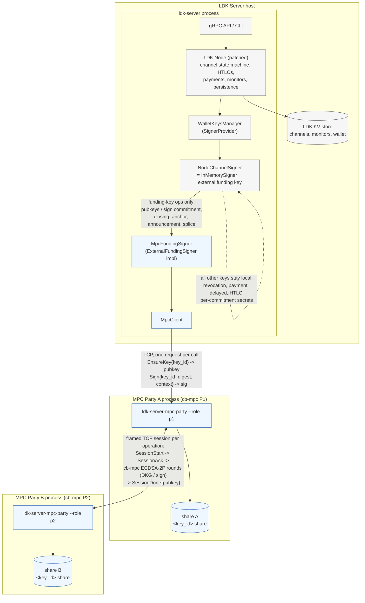

# ldk-server-mpc: Coinbase 2-of-2 MPC channel signing for LDK Server

Puts **every Lightning channel key** of an LDK Server node under Coinbase's
[`cb-mpc`](https://github.com/coinbase/cb-mpc) two-party ECDSA (ECDSA-2P): the funding key,
the payment, delayed-payment, HTLC and revocation basepoints, and the per-commitment secrets.
Two independent MPC processes each hold one share of every key; the complete private keys are
never assembled anywhere. Party B enforces a signing policy (recomputed sighashes, key-kind
binding, BOLT 3 derivation checks, monotonic commitment numbers, ordered secret release,
balance tracking, payout allow-list). All Lightning channel state stays in LDK Server / LDK
Node; the parties keep only key shares and the policy counters.

`coverage = "funding"` keeps the original funding-key-only mode.

## Architecture



Trust and data boundaries:

- **LDK Server** owns all Lightning state (channels, commitments, HTLCs, revocation
  secrets, monitors) and the on-chain wallet. It never sees a funding private key.
- **Party A (P1)** is the only endpoint LDK Server talks to and the only party that
  obtains the final signature (a property of cb-mpc's ECDSA-2P protocol). It holds share A.
- **Party B (P2)** only accepts protocol sessions from Party A and holds share B. Neither
  party stores any channel state; the only state is the opaque per-key share blob.
- The full private key never exists: DKG produces the shares directly, and signing is an
  interactive protocol over the shares.

Signing flow for one commitment update:

```text
 LDK channel state machine          MpcFundingSigner        Party A (P1)             Party B (P2)
 ────────────────────────           ────────────────        ────────────             ────────────
 sign_counterparty_commitment ─┐
   HTLC sigs: local htlc key   │
   funding sig: sighash ───────┼──▶ key_id = H(tag ‖ channel_keys_id)
                               │    Sign{key_id, digest, ctx} ──▶ load share A
                               │                                 policy.authorize (AllowAll)
                               │                                 SessionStart ────────────▶ load share B
                               │                                 ◀──────────── SessionAck   policy.authorize
                               │                                 ◀═ cb-mpc ECDSA-2P sign ═▶
                               │                                 DER sig (P1 only)
                               │                                 ◀──────────── SessionDone{pubkey}
                               │                                 verify, low-S normalize
                               │    ◀── Signature (compact)
                               │    verify against cached pubkey
 ◀─ (funding sig, HTLC sigs) ──┘
```

Legacy overview (same thing, flattened):

```text
                 LDK Server (ldk-server)
                     |  Builder::set_external_funding_signer(MpcFundingSigner)
                 LDK Node (patched, ../ldk-node)
                     |  SignerProvider -> NodeChannelSigner { InMemorySigner, external funding }
              MpcFundingSigner (ldk-server/src/mpc_signer.rs)
                     |  EnsureKey / Sign  (one TCP request per call, bounded timeouts)
              MpcClient (ldk-server-mpc/src/client.rs)
                     |
          +----------+-----------+
          |                      |
   MPC Party A (P1)  <------->  MPC Party B (P2)
   ldk-server-mpc-party         ldk-server-mpc-party
   cb-mpc ECDSA-2P, share A     cb-mpc ECDSA-2P, share B
```

## What is MPC-backed and what is not

With `coverage = "all"` (default):

| Key / operation                                        | Backing                                   |
|--------------------------------------------------------|-------------------------------------------|
| Funding key (2-of-2 funding multisig), spliced funding keys | **cb-mpc 2-of-2 (A + B)**, fresh DKG per splice |
| Payment point (`to_remote`)                            | MPC (static key)                          |
| Delayed-payment basepoint and per-commitment keys      | MPC; per-commitment key = share + BOLT 3 tweak |
| HTLC basepoint and per-commitment keys                 | MPC; same                                 |
| Revocation basepoint and revocation keys               | MPC; `share * H1 + secret * H2` on shares |
| Per-commitment secrets / points (`commitment_seed`)    | **Party B only**, released under policy   |
| Commitment, closing, anchor, announcement, splice sigs | MPC                                       |
| HTLC signatures (commitment updates, HTLC txs, claims) | MPC (one session per HTLC, in parallel)   |
| Justice transactions                                   | MPC                                       |
| Sweeps of `to_remote` / delayed `to_local` outputs     | MPC                                       |
| Node identity key, gossip, BOLT12, onion keys          | local (`KeysManager`)                     |
| On-chain wallet (BDK)                                  | local; own mnemonic (`onchain_wallet_mnemonic_path`) |

With `coverage = "funding"` only the first row is MPC-backed and everything else is the
local `InMemorySigner`.

### What this protects

With full coverage and Party B's policy, an attacker who controls the LDK Server host (seed,
database, process) cannot, without Party B:

- sign any new commitment, closing, splice, anchor or announcement (funding key);
- sign HTLC or justice transactions, or sweep channel outputs (all other keys);
- obtain a per-commitment secret ahead of its state being superseded (Party B releases a
  secret only after LDK has validated a newer holder commitment);
- get Party B to sign an old holder commitment (monotonic commitment numbers), a commitment
  that drops our balance by more than the configured cap, a cooperative close that does not
  pay our tracked balance to an allow-listed script, or a sweep to a non-allow-listed script;
- feed Party B a fake transaction: Party B recomputes every sighash from the transaction,
  input, value and witness script it is given, and verifies key derivations against the
  per-commitment point / revealed secret.

What a host compromise can still do: broadcast the latest *already-signed* holder
commitment (a force-close; the resulting outputs can only be swept to allow-listed scripts via
MPC), stall the node, leak the node identity key, and spend the on-chain wallet (its mnemonic
is still on the host; see remaining work).

## Components

- `ldk-server-mpc/src/ffi.rs` – raw declarations for the cb-mpc public C API
  (`cbmpc_ecdsa_2p_dkg`, `cbmpc_ecdsa_2p_sign`, `cbmpc_ecdsa_2p_refresh`,
  `cbmpc_ecdsa_2p_get_public_key_compressed`, memory helpers).
- `src/cbmpc.rs` – safe wrappers: `Job::dkg()`, `Job::sign()`, `KeyBlob`. The library runs
  the interactive protocol on the calling thread and uses a `Transport` (send/recv) callback
  pair to talk to the other party. The session id is left empty so cb-mpc derives it
  jointly (its recommended default); the safe `sign()` variant is used, never the
  global-abort variant.
- `src/transport.rs` – length-prefixed framing over TCP (`TcpTransport`) and an in-memory
  pair for tests/benchmarks.
- `src/protocol.rs` – minimal binary wire format. Client⇄P1: `Ping`, `EnsureKey{key_id}`,
  `GetPublicKey{key_id}`, `Sign{request_id, key_id, digest, context?}`. P1⇄P2:
  `SessionStart{op, key_id, digest?, context?}` → `SessionAck` → cb-mpc frames →
  `SessionDone{pubkey}` (so both sides confirm the same aggregate key).
- `src/party.rs` – the party service. Key shares live in `<keystore>/<key_id>.share`
  (opaque cb-mpc blobs, one file per key, written atomically). Signing sessions on one key
  are serialized with a per-key lock. P2 refuses a DKG for a key id it already holds.
  Every signature is verified against the aggregate key and normalized to low-S before it
  is returned.
- `src/client.rs` – `MpcClient`, blocking with bounded connect/request/DKG timeouts.
- `src/policy.rs` – `ChannelPolicy`, run by both parties (Party B authoritatively, Party A
  as a first line). Per channel it records the key id of each key kind at DKG time and the
  commitment / balance state. It verifies, for every signature: the recomputed sighash, the
  key kind for the operation, the BOLT 3 derivation, commitment-number monotonicity, our
  balance (located by script, not by metadata) against `--max-balance-decrease-sat`, and
  payout destinations (`--payout-xpub`, `--payout-address`) for closes and sweeps. Party B
  also holds the commitment-seed master secret and serves per-commitment points and secrets.
- `src/secure.rs` – PSK-authenticated, forward-secret encrypted framing (X25519 +
  HKDF-SHA256 + AES-256-GCM) for both links, and AES-256-GCM encryption of shares and the
  master secret at rest.
- `src/bin/party.rs` – `ldk-server-mpc-party --role p1|p2 ...` with `--auth-key-file`,
  `--peer-auth-key-file`, `--share-key-file`, `--payout-xpub`, `--payout-address`,
  `--max-balance-decrease-sat`, `--max-closing-fee-sat`.
- `src/bin/bench.rs` – `ldk-server-mpc-bench` latency benchmark.

### LDK integration points

- **ldk-node patch** (`contrib/patches/ldk-node-external-funding-signer.patch`, applied in
  the sibling checkout `../ldk-node`, wired via `[patch]` in the workspace `Cargo.toml`):
  - `ldk_node::signer::ExternalChannelSigner` trait: `channel_pubkeys`, `funding_pubkey`,
    `per_commitment_point`, `release_commitment_secret`, the two validation notices and
    batch `sign(requests)`. Every `SignRequest` carries the full transaction, input, value,
    witness script, sighash type and channel parameters.
  - `ldk_node::signer::NodeChannelSigner`, the node's `SignerProvider::EcdsaSigner`. With
    `KeyCoverage::AllChannelKeys` every `ChannelSigner`/`EcdsaChannelSigner` method and the
    `OutputSpender` sweeps go to the external signer; with `FundingOnly` just the funding
    key does.
  - `Builder::set_external_channel_signer`, `Builder::set_onchain_wallet_entropy`, and a
    5-second `signer_unblocked` poke so signatures that failed while the MPC was unreachable
    are retried.
  - Signers are restored through `SignerProvider::derive_channel_signer(channel_keys_id)`,
    so no serialization format changes.
- **ldk-server** (`ldk-server/src/mpc_signer.rs`): `MpcChannelSigner` maps
  `channel_keys_id` to one MPC key id per key kind (tagged SHA-256) and a policy channel
  id, runs the five DKGs in parallel on first use, derives the public keys for tweaked
  requests locally to verify signatures, and keeps undeliverable state notices in an
  ordered retry queue (an `Err` from LDK's validation callbacks would close the channel).
- Config: `[mpc] party_address = "127.0.0.1:7701"`, `coverage = "all" | "funding"`,
  `auth_key_path = "<32-byte PSK file from Party A's --auth-key-file>"`, optional
  `request_timeout_secs`, `dkg_timeout_secs`. LDK Server writes the wallet's BIP 84 account
  xpub to `<storage>/onchain_wallet_xpub` for Party B's `--payout-xpub`.
- **Separate on-chain wallet seed**: `[node] onchain_wallet_mnemonic_path = "<file>"` (or
  `--node-onchain-wallet-mnemonic-path` / `LDK_SERVER_NODE_ONCHAIN_WALLET_MNEMONIC_PATH`).
  The ldk-node patch adds `Builder::set_onchain_wallet_entropy`, which derives the BDK
  wallet descriptors from that mnemonic while node identity, channel keys and LSPS/LNURL
  keys keep using the node mnemonic. Without it, LDK Node derives both from one seed, so a
  stolen node seed also controls every sweep destination. Fresh nodes only.

Per-commitment keys use two small additions to cb-mpc
(`contrib/patches/cb-mpc-additive-tweak-derivation.patch`): `ecdsa_2p::derive_additive_tweak`
(`key + t`, the non-hardened step of cb-mpc's own HD keyset derivation with an explicit
scalar) and `ecdsa_2p::derive_mul_add` (`key * m + a`, for revocation keys; both shares are
scaled and P1's Paillier ciphertext is scaled homomorphically). Both are local and need no
round trip; derived blobs are ephemeral and never refreshed. Spliced funding keys use a fresh
DKG keyed by `(channel_keys_id, splice_parent_funding_txid)`.

## Building

1. Build cb-mpc (with the derivation patch) and its custom OpenSSL (one-time; macOS arm64
   shown, see cb-mpc's README for Linux):

   ```bash
   git clone https://github.com/coinbase/cb-mpc ../cb-mpc
   cd ../cb-mpc && git checkout 0b71670 && git submodule update --init vendors/secp256k1
   git am ../ldk-server/contrib/patches/cb-mpc-additive-tweak-derivation.patch
   pip3 install --user cmake            # if cmake is not installed
   export CBMPC_OPENSSL_ROOT=$PWD/openssl-3.6.4-install
   bash scripts/openssl/build-static-openssl-macos-m1.sh
   cmake -S . -B build/release -DCMAKE_BUILD_TYPE=Release -DBUILD_TESTS=OFF \
         -DCBMPC_OPENSSL_ROOT=$CBMPC_OPENSSL_ROOT
   cmake --build build/release -j8      # produces lib/Release/libcbmpc.a
   ```

   `build.rs` looks for `../cb-mpc` relative to the workspace (override with `CBMPC_DIR`,
   `CBMPC_LIB_DIR`, `CBMPC_OPENSSL_ROOT`).

2. Check out the patched ldk-node next to this repository:

   ```bash
   git clone https://github.com/lightningdevkit/ldk-node ../ldk-node
   cd ../ldk-node && git checkout f375e4d5de18093c29a023f19f08c93d890af220
   git am ../ldk-server/contrib/patches/ldk-node-external-funding-signer.patch
   ```

3. `cargo build --release -p ldk-server -p ldk-server-cli -p ldk-server-mpc`

## Running

```bash
# 1: Party A (creates client.psk / peer.psk / share key files if missing)
ldk-server-mpc-party --role p1 --listen 127.0.0.1:7701 --peer 127.0.0.1:7702 \
  --keystore mpc/a --auth-key-file mpc/client.psk --peer-auth-key-file mpc/peer.psk \
  --share-key-file mpc/share-a.key
# 2: LDK Server (fresh storage dir) with [mpc] party_address / auth_key_path and
#    [node] onchain_wallet_mnemonic_path; it writes <storage>/onchain_wallet_xpub
ldk-server my-config.toml
# 3: Party B with the wallet xpub allow-listed (copy peer.psk to Party B's host)
ldk-server-mpc-party --role p2 --listen 127.0.0.1:7702 --keystore mpc/b \
  --peer-auth-key-file mpc/peer.psk --share-key-file mpc/share-b.key \
  --payout-xpub "$(cat <storage>/onchain_wallet_xpub)" --max-balance-decrease-sat 100000
# 4: key shares are generated on first channel open (five DKGs per channel, in parallel)
```

`contrib/mpc-signet/run-mpc-parties.sh` starts both parties on one machine for a demo.

Enable MPC only on a fresh node. Existing channels were created with locally derived
funding keys; `derive_channel_signer` would hand them an MPC pubkey that does not match
the on-chain funding script. If the MPC service is unreachable when a channel signer must
be derived (startup, channel open), the node aborts with a clear error rather than running
with a mismatched key.

## Tests

```bash
cargo test -p ldk-server-mpc                 # unit + two-party + service tests
cd e2e-tests && cargo test --test mpc -- --test-threads=1   # regtest, downloads bitcoind
```

- `tests/two_party.rs`: genuine cb-mpc DKG + sign in-process, aggregate key agreement,
  signatures verify against the aggregate key, mismatched shares fail, transport failure
  is reported.
- `tests/service.rs`: full client→P1→P2 path over TCP: DKG + sign + restart/share
  restoration, invalid key id, MPC process unavailable (client and P2), bounded signing
  timeout, repeated and concurrent requests, P2 refusing DKG for an existing key id.
- `tests/service.rs` also covers PSK-secured links (correct, wrong and missing PSK) and
  encrypted shares / master secret.
- `src/policy.rs` unit tests: sighash mismatch, key-kind mismatch, HTLC and revocation
  derivation checks, commitment monotonicity with the balance cap, secret release ordering,
  closing allow-list with balance, sweep destinations.
- `e2e-tests/tests/mpc.rs`: two `ldk-server` processes on regtest, server A with full MPC
  coverage, PSK links, encrypted shares and Party B allow-listing the wallet xpub: open
  channel (five DKGs), pay both directions, restart MPC parties, restart LDK Server,
  cooperative close (closing tx's 2-of-2 redeem script contains a DKG'd key), and a separate
  holder force-close test.

## Security notes / remaining work

- **On-chain wallet mnemonic is still on the LDK Server host.** With
  `onchain_wallet_mnemonic_path` it is at least not derivable from the node seed, and Party B
  only signs closes/sweeps to that wallet's addresses, so a host compromise can force funds
  *into* the wallet but not elsewhere. Moving on-chain signing off-host (PSBT signer, HSM) is
  the remaining step to make channel funds unreachable from the host.
- **Party B must run on separate infrastructure** with its own administrator. On one machine
  the two parties are a process boundary, not a trust boundary.
- **Share keys and PSKs are files.** They are generated with `0600` permissions and should be
  kept on a different medium than the keystore (or in a KMS/HSM).
- **Policy scope.** The balance cap is a per-update delta, not a price-based rule; HTLC
  accounting (which HTLCs may be settled) is not enforced. Counterparty revocation notices are
  recorded but not verified.
- **cb-mpc full API.** The two derivation functions use cb-mpc's internal key representation
  (the same arithmetic as its HD keyset derivation) and are outside the public API's
  bug-bounty surface. Derived blobs must never be refreshed.
- **Availability.** Nothing in a channel (including force-close and sweeps) works without
  Party B. Signatures that fail while the MPC is unreachable are retried via the periodic
  `signer_unblocked`; state notices are queued and replayed in order.
- Key refresh (`cbmpc_ecdsa_2p_refresh`) is wrapped but not exposed through the service.
