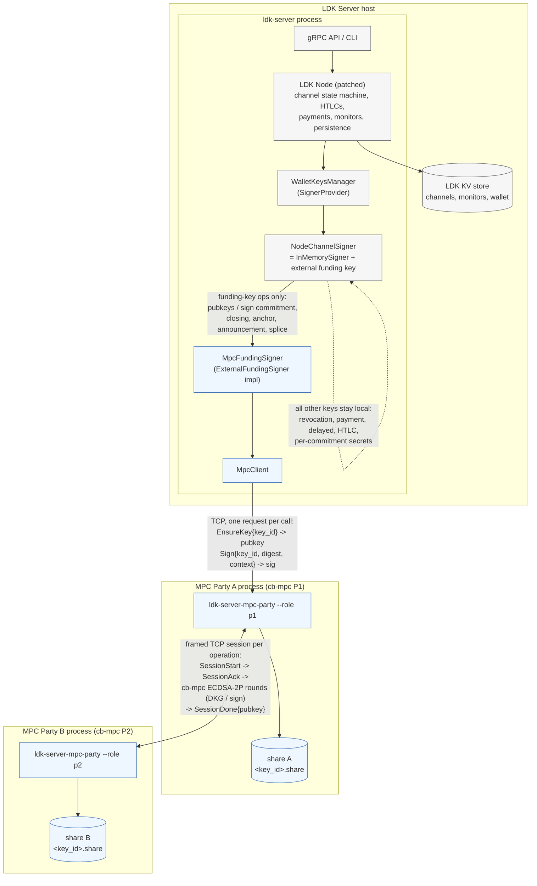

# ldk-server-mpc: Coinbase 2-of-2 MPC channel signing for LDK Server

Proof of concept that puts the Lightning **channel funding key** of an LDK Server node under
Coinbase's [`cb-mpc`](https://github.com/coinbase/cb-mpc) two-party ECDSA (ECDSA-2P).
Two independent MPC processes each hold one key share; the complete private key is never
assembled anywhere. All Lightning channel state stays in LDK Server / LDK Node.

## Architecture



Trust and data boundaries:

- **LDK Server** owns all Lightning state (channels, commitments, HTLCs, revocation
  secrets, monitors) and the on-chain wallet. It never sees a funding private key.
- **Party A (P1)** is the only endpoint LDK Server talks to and the only party that
  obtains the final signature (a property of cb-mpc's ECDSA-2P protocol). It holds share A.
- **Party B (P2)** only accepts protocol sessions from Party A and holds share B. Neither
  party stores any channel state; the only state is the opaque per-key share blob.
- The full private key never exists: DKG produces the shares directly, and signing is an
  interactive protocol over the shares.

Signing flow for one commitment update:

```text
 LDK channel state machine          MpcFundingSigner        Party A (P1)             Party B (P2)
 ────────────────────────           ────────────────        ────────────             ────────────
 sign_counterparty_commitment ─┐
   HTLC sigs: local htlc key   │
   funding sig: sighash ───────┼──▶ key_id = H(tag ‖ channel_keys_id)
                               │    Sign{key_id, digest, ctx} ──▶ load share A
                               │                                 policy.authorize (AllowAll)
                               │                                 SessionStart ────────────▶ load share B
                               │                                 ◀──────────── SessionAck   policy.authorize
                               │                                 ◀═ cb-mpc ECDSA-2P sign ═▶
                               │                                 DER sig (P1 only)
                               │                                 ◀──────────── SessionDone{pubkey}
                               │                                 verify, low-S normalize
                               │    ◀── Signature (compact)
                               │    verify against cached pubkey
 ◀─ (funding sig, HTLC sigs) ──┘
```

Legacy overview (same thing, flattened):

```text
                 LDK Server (ldk-server)
                     |  Builder::set_external_funding_signer(MpcFundingSigner)
                 LDK Node (patched, ../ldk-node)
                     |  SignerProvider -> NodeChannelSigner { InMemorySigner, external funding }
              MpcFundingSigner (ldk-server/src/mpc_signer.rs)
                     |  EnsureKey / Sign  (one TCP request per call, bounded timeouts)
              MpcClient (ldk-server-mpc/src/client.rs)
                     |
          +----------+-----------+
          |                      |
   MPC Party A (P1)  <------->  MPC Party B (P2)
   ldk-server-mpc-party         ldk-server-mpc-party
   cb-mpc ECDSA-2P, share A     cb-mpc ECDSA-2P, share B
```

## What is MPC-backed and what is not

| Key / operation                                   | Backing                         |
|---------------------------------------------------|---------------------------------|
| Funding key (2-of-2 funding multisig)             | **cb-mpc 2-of-2 (A + B)**       |
| `sign_counterparty_commitment` (funding sig)      | MPC                             |
| `sign_holder_commitment`                          | MPC                             |
| `sign_closing_transaction`                        | MPC                             |
| `sign_holder_keyed_anchor_input`                  | MPC                             |
| `sign_channel_announcement_with_funding_key`      | MPC                             |
| `sign_splice_shared_input` / spliced funding key  | MPC (fresh DKG per splice)      |
| HTLC signatures inside `sign_counterparty_commitment` | local (`InMemorySigner`)    |
| Revocation, payment, delayed-payment, HTLC basepoints | local                       |
| Per-commitment secrets / points (`commitment_seed`)   | local                       |
| Justice / HTLC claim / anchor-HTLC transactions   | local                           |
| Node identity key, gossip, BOLT12, onion keys     | local (`KeysManager`)           |
| On-chain wallet (BDK)                             | local, unchanged                |

This is **funding-key protection only**. Without Party B, a compromised LDK Server host
cannot produce a funding-multisig signature (new commitment, cooperative close, splice,
keyed anchor, announcement). It still holds every local key, so it can:

- broadcast an already-signed old commitment (the signature exists; MPC cannot revoke it),
- leak per-commitment secrets, enabling the counterparty to claim revoked states,
- force-close with the already-signed latest commitment, wait out the delay, and sweep the
  confirmed `to_local` and HTLC outputs with the delayed-payment and HTLC keys to any
  address. The normal sweep destination is the BDK wallet, which is derived from the same
  seed, so "the funds return to our on-chain wallet" offers no protection against a host
  compromise,
- claim or time out HTLCs,
- and ask Party B for any funding-key signature, since the only policy is `AllowAllPolicy`
  and the signing context is not verified.

The result is a custody split for the funding key, not a validating signer. The local keys
stayed local because the cb-mpc public ECDSA-2P API has no share-tweak/derivation
operation, and the per-commitment keys are tweaked basepoints (revocation keys use a
two-sided multiplicative tweak). Full coverage needs tweak support (or derivation inside
the parties) plus a state-tracking policy on Party B.

## Components

- `ldk-server-mpc/src/ffi.rs` – raw declarations for the cb-mpc public C API
  (`cbmpc_ecdsa_2p_dkg`, `cbmpc_ecdsa_2p_sign`, `cbmpc_ecdsa_2p_refresh`,
  `cbmpc_ecdsa_2p_get_public_key_compressed`, memory helpers).
- `src/cbmpc.rs` – safe wrappers: `Job::dkg()`, `Job::sign()`, `KeyBlob`. The library runs
  the interactive protocol on the calling thread and uses a `Transport` (send/recv) callback
  pair to talk to the other party. The session id is left empty so cb-mpc derives it
  jointly (its recommended default); the safe `sign()` variant is used, never the
  global-abort variant.
- `src/transport.rs` – length-prefixed framing over TCP (`TcpTransport`) and an in-memory
  pair for tests/benchmarks.
- `src/protocol.rs` – minimal binary wire format. Client⇄P1: `Ping`, `EnsureKey{key_id}`,
  `GetPublicKey{key_id}`, `Sign{request_id, key_id, digest, context?}`. P1⇄P2:
  `SessionStart{op, key_id, digest?, context?}` → `SessionAck` → cb-mpc frames →
  `SessionDone{pubkey}` (so both sides confirm the same aggregate key).
- `src/party.rs` – the party service. Key shares live in `<keystore>/<key_id>.share`
  (opaque cb-mpc blobs, one file per key, written atomically). Signing sessions on one key
  are serialized with a per-key lock. P2 refuses a DKG for a key id it already holds.
  Every signature is verified against the aggregate key and normalized to low-S before it
  is returned.
- `src/client.rs` – `MpcClient`, blocking with bounded connect/request/DKG timeouts.
- `src/policy.rs` – `SigningPolicy` trait with the only implementation `AllowAllPolicy`.
  The `SigningContext` (op kind, channel keys id, channel value, commitment number, funding
  outpoint, splice parent) is informational metadata supplied by LDK and is **not
  verified** by the parties.
- `src/bin/party.rs` – `ldk-server-mpc-party --role p1|p2 ...`.
- `src/bin/bench.rs` – `ldk-server-mpc-bench` latency benchmark.

### LDK integration points

- **ldk-node patch** (`contrib/patches/ldk-node-external-funding-signer.patch`, applied in
  the sibling checkout `../ldk-node`, wired via `[patch]` in the workspace `Cargo.toml`):
  - `ldk_node::signer::ExternalFundingSigner` trait (`funding_pubkey`,
    `sign_with_funding_key`).
  - `ldk_node::signer::NodeChannelSigner`, the node's `SignerProvider::EcdsaSigner`. It
    wraps `InMemorySigner` and overrides `pubkeys().funding_pubkey`,
    `new_funding_pubkey` and the six funding-key signing methods when an external signer
    is configured. Everything else delegates to `InMemorySigner`.
  - `Builder::set_external_funding_signer(Arc<dyn ExternalFundingSigner>)`.
  - Signers are restored through `SignerProvider::derive_channel_signer(channel_keys_id)`,
    so no serialization format changes.
- **ldk-server** (`ldk-server/src/mpc_signer.rs`): `MpcFundingSigner` maps
  `channel_keys_id` (+ optional splice parent txid) to an MPC key id with a tagged SHA-256,
  calls `EnsureKey` (idempotent; runs DKG on first use) for public keys and `Sign` for
  signatures, caching public keys in memory.
- Config: `[mpc] party_address = "127.0.0.1:7701"` (or `--mpc-party-address` /
  `LDK_SERVER_MPC_PARTY_ADDRESS`), optional `request_timeout_secs`, `dkg_timeout_secs`.
- **Separate on-chain wallet seed**: `[node] onchain_wallet_mnemonic_path = "<file>"` (or
  `--node-onchain-wallet-mnemonic-path` / `LDK_SERVER_NODE_ONCHAIN_WALLET_MNEMONIC_PATH`).
  The ldk-node patch adds `Builder::set_onchain_wallet_entropy`, which derives the BDK
  wallet descriptors from that mnemonic while node identity, channel keys and LSPS/LNURL
  keys keep using the node mnemonic. Without it, LDK Node derives both from one seed, so a
  stolen node seed also controls every sweep destination. Fresh nodes only.

cb-mpc does not expose additive tweaks for ECDSA-2P keys, so spliced channels do not tweak
the base key (as `InMemorySigner` does); instead `new_funding_pubkey` triggers a fresh
DKG keyed by `(channel_keys_id, splice_parent_funding_txid)`.

## Building

1. Build cb-mpc and its custom OpenSSL (one-time; macOS arm64 shown, see cb-mpc's README
   for Linux):

   ```bash
   git clone https://github.com/coinbase/cb-mpc ../cb-mpc
   cd ../cb-mpc && git submodule update --init vendors/secp256k1
   pip3 install --user cmake            # if cmake is not installed
   export CBMPC_OPENSSL_ROOT=$PWD/openssl-3.6.4-install
   bash scripts/openssl/build-static-openssl-macos-m1.sh
   cmake -S . -B build/release -DCMAKE_BUILD_TYPE=Release -DBUILD_TESTS=OFF \
         -DCBMPC_OPENSSL_ROOT=$CBMPC_OPENSSL_ROOT
   cmake --build build/release -j8      # produces lib/Release/libcbmpc.a
   ```

   `build.rs` looks for `../cb-mpc` relative to the workspace (override with `CBMPC_DIR`,
   `CBMPC_LIB_DIR`, `CBMPC_OPENSSL_ROOT`).

2. Check out the patched ldk-node next to this repository:

   ```bash
   git clone https://github.com/lightningdevkit/ldk-node ../ldk-node
   cd ../ldk-node && git checkout f375e4d5de18093c29a023f19f08c93d890af220
   git am ../ldk-server/contrib/patches/ldk-node-external-funding-signer.patch
   ```

3. `cargo build --release -p ldk-server -p ldk-server-cli -p ldk-server-mpc`

## Running

```bash
# 1 + 2: start the parties (separate processes, separate keystores)
contrib/mpc-signet/run-mpc-parties.sh
# 3: key shares are generated lazily on first channel open (EnsureKey -> DKG)
# 4: start LDK Server with an [mpc] section, on a FRESH storage dir
target/release/ldk-server contrib/mpc-signet/ldk-server-signet-mpc.toml
```

Enable MPC only on a fresh node. Existing channels were created with locally derived
funding keys; `derive_channel_signer` would hand them an MPC pubkey that does not match
the on-chain funding script. If the MPC service is unreachable when a channel signer must
be derived (startup, channel open), the node aborts with a clear error rather than running
with a mismatched key.

## Tests

```bash
cargo test -p ldk-server-mpc                 # unit + two-party + service tests
cd e2e-tests && cargo test --test mpc -- --test-threads=1   # regtest, downloads bitcoind
```

- `tests/two_party.rs`: genuine cb-mpc DKG + sign in-process, aggregate key agreement,
  signatures verify against the aggregate key, mismatched shares fail, transport failure
  is reported.
- `tests/service.rs`: full client→P1→P2 path over TCP: DKG + sign + restart/share
  restoration, invalid key id, MPC process unavailable (client and P2), bounded signing
  timeout, repeated and concurrent requests, P2 refusing DKG for an existing key id.
- `e2e-tests/tests/mpc.rs`: two `ldk-server` processes on regtest, server A with MPC: open
  channel, pay both directions, restart MPC parties, restart LDK Server, cooperative close
  (closing tx's 2-of-2 redeem script contains the DKG'd key), and a separate holder
  force-close test.

## Security notes / remaining work

- Key shares are stored **unencrypted** on disk. cb-mpc recommends envelope encryption
  with an external KMS/HSM. The P1 blob also contains Paillier private material.
- Transport between parties and from LDK Server to P1 is plain TCP on localhost. For
  anything beyond one machine, add mutual TLS and authentication.
- No policy: `AllowAllPolicy` signs anything P1 is asked to sign. The signing context is
  unverified metadata.
- Party identifiers (`--p1-name/--p2-name`) are cb-mpc `pid`s and must be stable and
  unique per deployment.
- Only the funding key is MPC-backed (see table above). Full coverage would need
  per-commitment key derivation (`derive_private_key` tweaks) on MPC shares, which the
  cb-mpc public ECDSA-2P API does not expose.
- The separate on-chain wallet seed still lives on the LDK Server host. The next step is to
  keep it off-host (hardware signer / separate PSBT signing service) and have Party B only
  sign sweeps to pre-approved destinations.
- Key refresh (`cbmpc_ecdsa_2p_refresh`) is wrapped but not exposed through the service.
- Signing is synchronous with timeouts. On a timeout the signer returns `Err`, which LDK
  treats as "signer unavailable"; LDK Node does not currently call `signer_unblocked`, so
  a stuck channel requires a restart.
